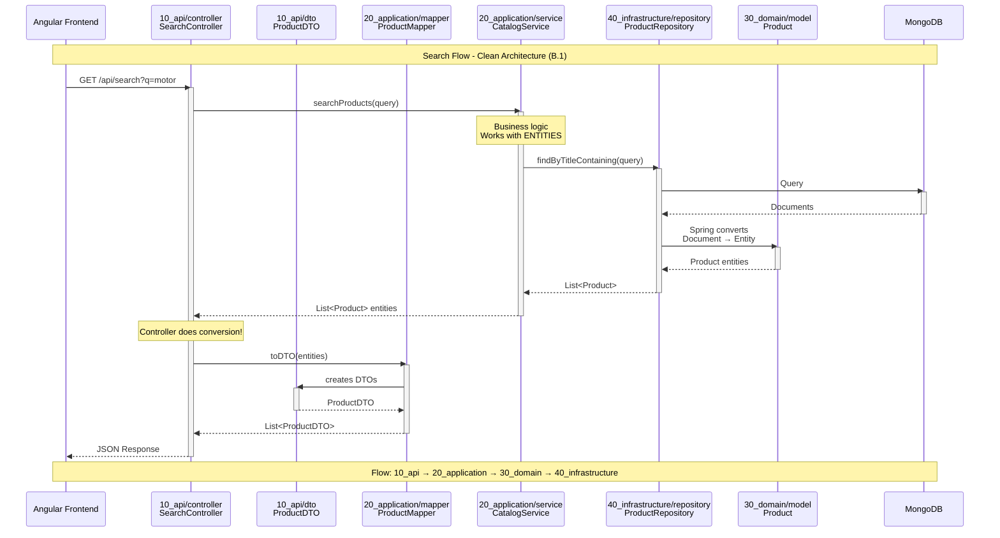

# Online Catalog - Architecture Design

## System Flow - Search Request


---

# Package Structure (English)
```
backend/src/main/java/catalog/
├── BackendApplication.java
│
├── 10_api/                          # PRESENTATION LAYER
│   ├── controller/                  # HTTP endpoints
│   │   ├── HealthController.java
│   │   └── SearchController.java
│   └── dto/                         # Data Transfer Objects (JSON)
│       ├── ProductDTO.java
│       └── SearchResultDTO.java
│
├── 20_application/                  # APPLICATION LAYER
│   ├── service/                     # Business logic
│   │   └── CatalogService.java
│   └── mapper/                      # Entity ↔ DTO conversion
│       └── ProductMapper.java
│
├── 30_domain/                       # DOMAIN LAYER
│   └── model/                       # Domain entities
│       └── Product.java
│
└── 40_infrastructure/               # INFRASTRUCTURE LAYER
    ├── repository/                  # Data access
    │   └── ProductRepository.java
    └── config/                      # Spring configuration
        └── MongoConfig.java
