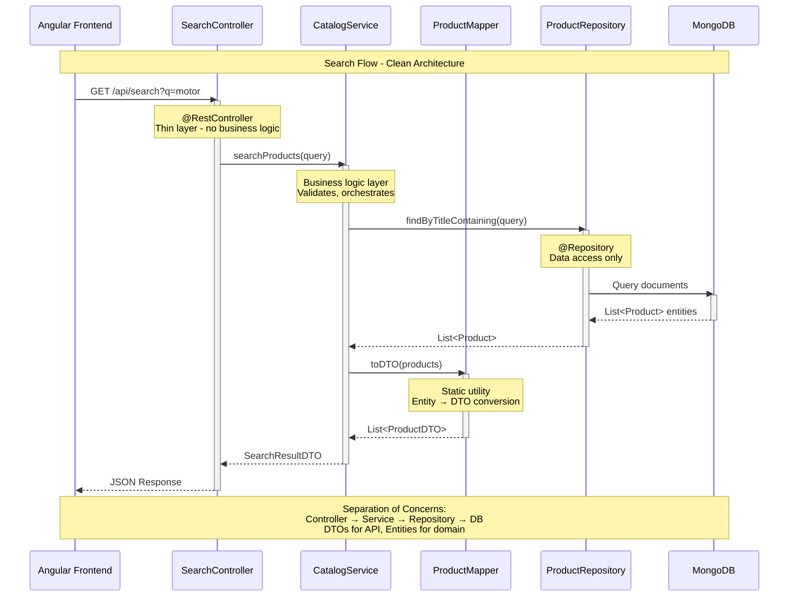

# Online Catalog - Architecture Design

## System Flow - Search Request


## Package Structure
```
src/main/java/com/catalog/
├── controller/      # HTTP Layer - THIN!
├── service/         # Business Logic
├── repository/      # Data Access
├── model/           # Domain Entities
├── dto/             # API DTOs
├── mapper/          # Conversion
└── config/          # Configuration
```
